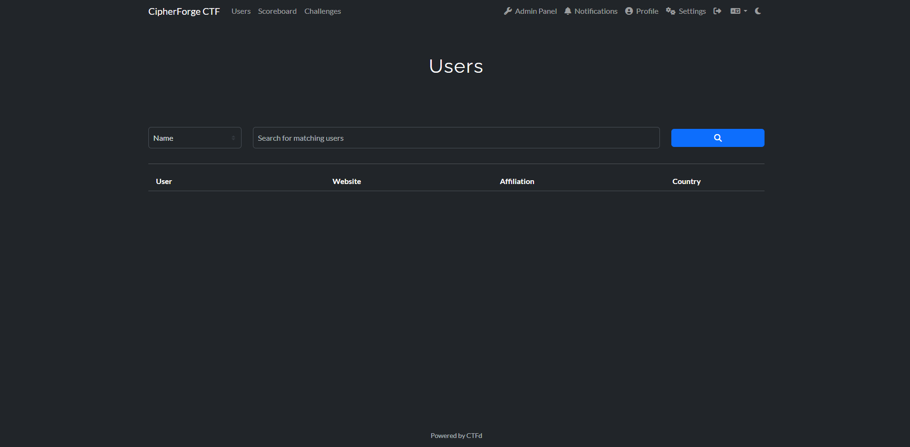
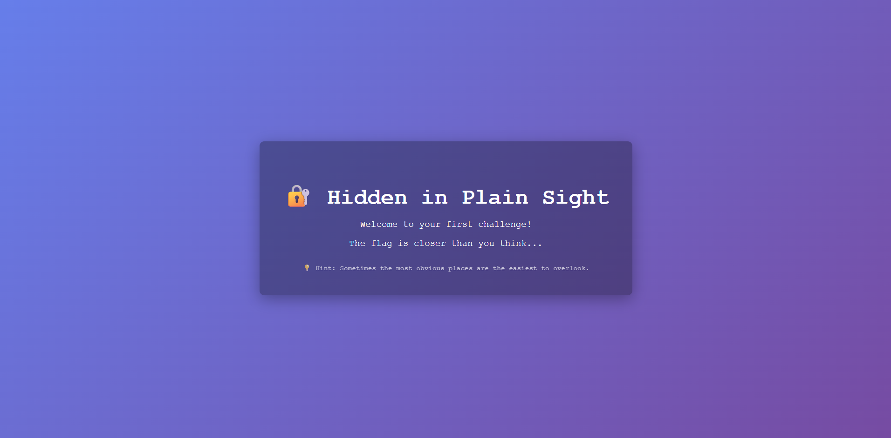
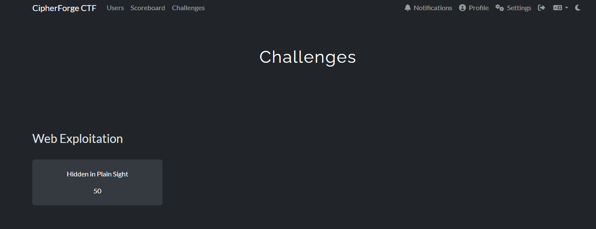

# 🔐 CipherForge

**A comprehensive cybersecurity portfolio project featuring custom CTF challenges and infrastructure.**

> ⚠️ This project is under active development. Documentation and challenges are being added progressively.

---

## 📋 Project Overview

CipherForge is a locally-hosted Capture The Flag (CTF) platform built with Docker, featuring custom-designed security challenges across multiple categories.

**Categories:**
   - 🌐 Web Exploitation (1 challenge)
   - 🔒 Cryptography (coming soon)
   - 🔍 Forensics (coming soon)
   - 🎯 Miscellaneous (coming soon)
   - ⚙️ Reverse Engineering (coming soon)
   - 🔑 Privilege Escalation (coming soon)

---

## 🏗️ Architecture

- **Platform:** CTFd (containerized)
- **Challenges:** Individual Docker containers per challenge
- **Deployment:** Local-only via Docker Compose

---

## 📂 Repository Structure
```
CipherForge/
├── challenges/       # All CTF challenge source code
├── docs/            # Documentation, diagrams, screenshots
├── scripts/         # Setup and deployment scripts
└── .github/         # CI/CD workflows
```

---

## 🚀 Quick Start
   
   ### Prerequisites
   - Docker Desktop installed and running
   - Git installed
   
   ### Launch CTFd Platform
```bash
   docker-compose up -d
```
   Access CTFd at: `http://localhost:8000`
   
   ### Run Individual Challenges
   Each challenge has its own README with setup instructions.
   
   Example:
```bash
   cd challenges/web/hidden-in-plain-sight
   docker build -t cipherforge/hidden-in-plain-sight .
   docker run -d -p 8001:80 --name hidden-in-plain-sight cipherforge/hidden-in-plain-sight
```

---

## 📸 Screenshots

### CTFd Platform Dashboard

*Local CTFd instance with custom challenges*

### Challenge Example: Hidden in Plain Sight

*Web exploitation challenge interface*


*Challenges displayed in CTFd platform*

---

## 🛠️ Technologies Used

- Docker & Docker Compose
- CTFd Platform
- Python, JavaScript, Bash
- Linux Containers

---

## 📚 Documentation

- **[Challenge Index](docs/CHALLENGES.md)** - Complete list of all challenges
- **[Architecture Overview](docs/README.md)** - System design and infrastructure
- **[Setup Guide](#-quick-start)** - Installation and deployment instructions
- **Challenge Writeups** - Available in each challenge folder

---

## 📝 License

This project is for educational and portfolio purposes.

---

**Built with 🔥 by Ivaylo Atanassov**