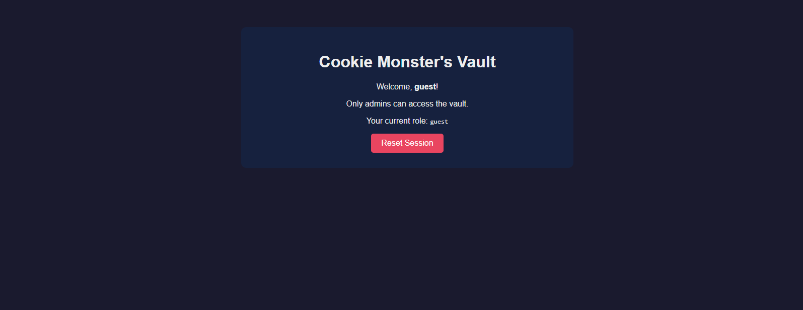
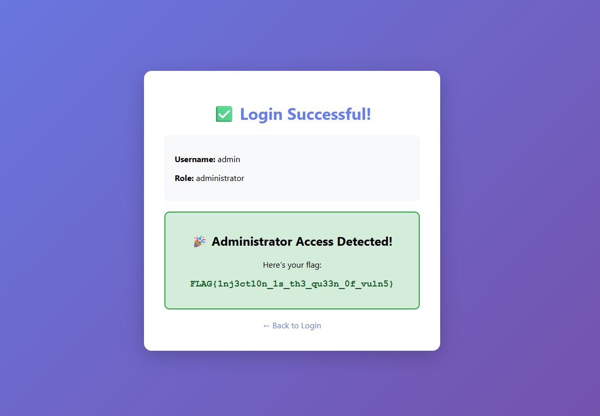

# CipherForge

**A cybersecurity portfolio project featuring custom CTF challenges and local infrastructure.**

> **Current Focus:** Web exploitation vulnerabilities (SQL injection, authentication bypass, client-side security)

---

## Project Overview

CipherForge is a locally-hosted Capture The Flag (CTF) platform featuring custom-designed security challenges. Built with Docker for consistent deployment, each challenge shows real-world vulnerabilities with exploitation guides and remediation advice.

**Key Features:**
- Full CTFd platform integration
- Dockerized challenges for easy deployment
- Documentation and writeups
- Real-world vulnerability examples

---

## Completed Challenges

| # | Challenge | Category | Difficulty | Vulnerability Type | Port |
|---|-----------|----------|------------|-------------------|------|
| 1 | [Hidden in Plain Sight](challenges/web/hidden-in-plain-sight/) | Web | Easy | HTML source code comments | 8001 |
| 2 | [Cookie Monster](challenges/web/cookie-monster/) | Web | Easy-Medium | Insecure Cookie Handling | 8002 |
| 3 | [Injection Master](challenges/web/injection-master/) | Web | Medium | SQL Injection | 8003 |

 **[View Full Challenge Index](docs/CHALLENGES.md)**

---

## Quick Start

### Prerequisites
- Docker Desktop installed and running
- Git installed
- Windows/macOS/Linux compatible

### 1. Clone Repository
```bash
git clone https://github.com/Abditus0/CipherForge.git
cd CipherForge
```

### 2. Launch CTFd Platform
```bash
docker-compose up -d
```
Access CTFd at: **http://localhost:8000**

### 3. Run Challenges

**Example: Hidden in Plain Sight**
```bash
cd challenges/web/hidden-in-plain-sight
docker build -t hidden-in-plain-sight .
docker run -d -p 8001:80 --name hidden-in-plain-sight hidden-in-plain-sight
```
Access at: **http://localhost:8001**

**Example: Cookie Monster**
```bash
cd challenges/web/cookie-monster
docker build -t cookie-monster .
docker run -d -p 8002:5000 --name cookie-monster cookie-monster
```
Access at: **http://localhost:8002**

**Example: Injection Master**
```bash
cd challenges/web/injection-master
docker build -t injection-master .
docker run -d -p 8003:5000 --name injection-master injection-master
```
Access at: **http://localhost:8003**

---

## Screenshots

### CTFd Platform
<table>
  <tr>
    <td></td>
    <td></td>
  </tr>
  <tr>
    <td align="center"><b>Dashboard View</b></td>
    <td align="center"><b>Challenge List</b></td>
  </tr>
</table>

### Challenge Examples

<table>
  <tr>
    <td></td>
    <td></td>
  </tr>
  <tr>
    <td align="center"><b>Cookie Monster - Login Portal</b></td>
    <td align="center"><b>Injection Master - Exploit Success</b></td>
  </tr>
</table>

*More screenshots available in [docs/screenshots/](docs/screenshots/)*

---

## Documentation

| Document | Description |
|----------|-------------|
| [Challenge Index](docs/CHALLENGES.md) | Complete catalog with descriptions, screenshots, and links |
| [Documentation Guide](docs/README.md) | Overview of documentation structure |
| Individual READMEs | Setup instructions for each challenge |
| Writeups | Detailed exploitation guides in each challenge folder |

---

## Roadmap

**Current Phase:** Web Exploitation Fundamentals 

**Next Steps:**
- Add Cross-Site Scripting (XSS) challenge
- Add Command Injection challenge
- Introduce Cryptography category
- Add Forensics challenges
- Implement automated testing (CI/CD)
- Create architecture diagrams

---

## About

This project will serve as a complete cybersecurity portfolio, showing:
- Practical vulnerability research and exploitation
- Secure development practices
- Documentation
- Infrastructure deployment skills

Built as a learning platform.

---

## License

This project is for educational and portfolio purposes.

**Note:** Challenges contain intentional vulnerabilities for educational purposes. Do not deploy publicly or use in production environments.

---

 **Star this repo if you find it useful!**